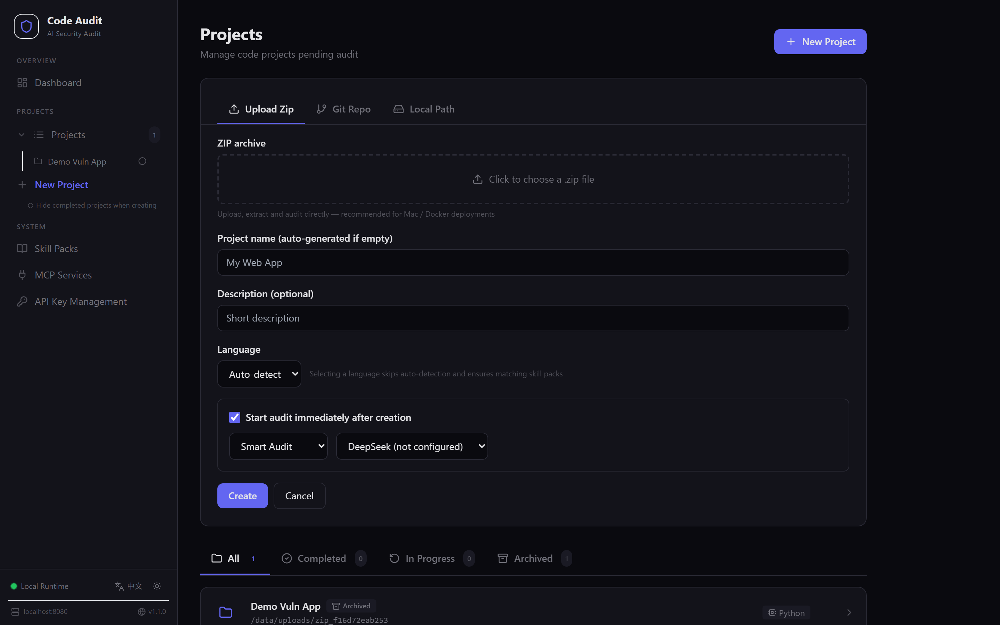
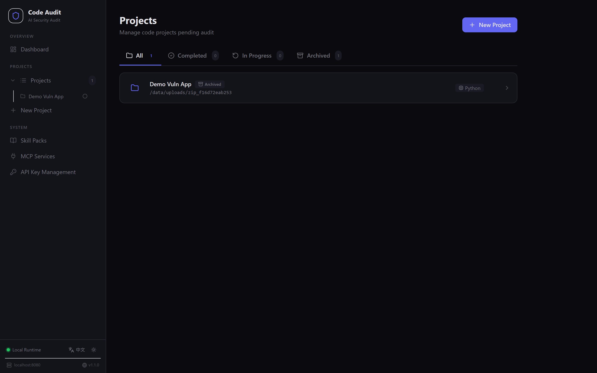
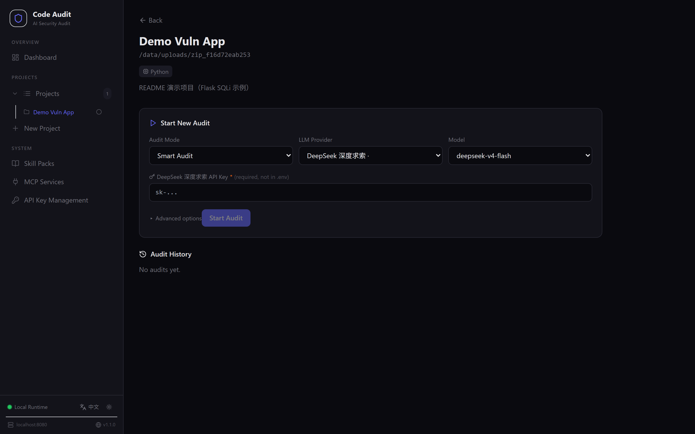
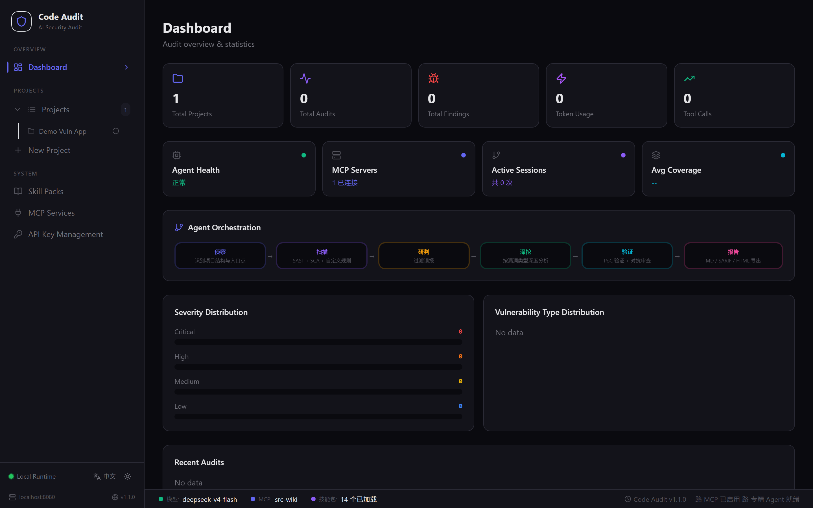
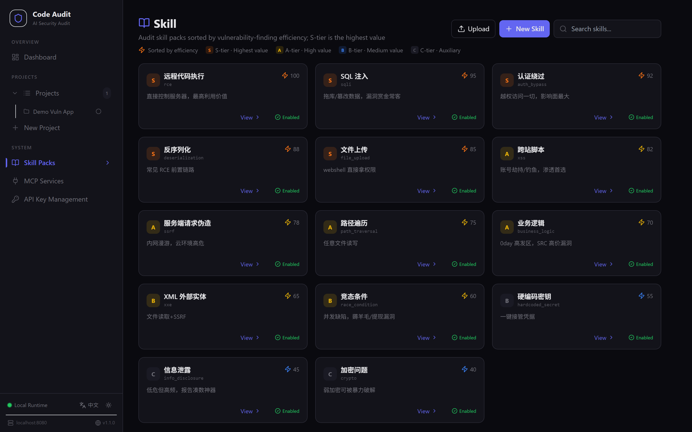
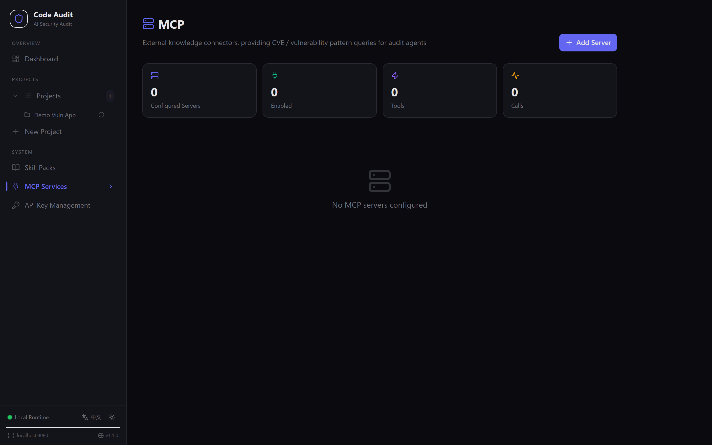
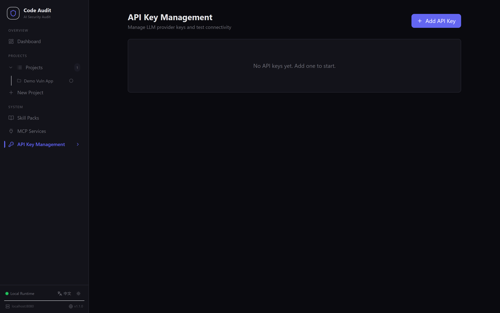

# CodeAudit — AI-Driven Code Security Audit Platform

> Multi-stage Agent Pipeline · Multi-Agent Collaboration · SAST/SCA Engines · MCP Knowledge Enhancement · Adversarial Verification

CodeAudit is an open-source AI code security audit platform that simulates security expert workflows. Multiple agents (Orchestrator / Recon / Specialist / Verifier / Reporter) collaborate to deliver automated vulnerability discovery and verification — from code import to audit report.

It is not just a static scanner: it combines LLM deep analysis with traditional SAST engines (Semgrep / SCA / custom rules) and produces high-quality findings with complete attack chains (Source → Sink) and actionable remediation advice.

## ✨ Features

### 🧠 Multi-Agent Collaboration

| Agent | Role |
|-------|------|
| **Orchestrator** | Strategy planning, task dispatch, result aggregation, false-positive filtering, report generation |
| **Recon** | Project structure analysis, entry-point extraction, danger-pattern scanning (attack surface map) |
| **Specialist** | Dispatched by vulnerability class (SQLi / XSS / Auth / RCE / Deserialization...), one class per agent |
| **Verifier** | Adversarial cross-validation (dual-model), PoC checking, false-positive rejection |
| **Reporter** | What-Why-How structured report generation |

- **Shared Findings Bus**: cross-agent coordination, deduplication by signature
- **Two-wave orchestration**: core specialists first, then remaining agents continue with peer-finding context
- **Adversarial verification**: independent model reviews every finding; REJECTED findings are dropped

### 🔍 Three Audit Modes

| Mode | Pipeline | Use Case |
|------|----------|----------|
| ⚡ Quick Scan | Recon → Scan → Triage → Finalize | Fast coverage, engine scan + false-positive filtering |
| 🧠 Smart Audit | Recon → Finding → Verification → Finalize | Deep manual digging with specialist dispatch, 0day research |
| 🔳 Comprehensive | Full pipeline | Full audit: engines + deep analysis + verification |

### 🛠 Engine Scanning (Graceful Degradation)

- **Semgrep SAST**: OWASP rules, hits injected as Triage candidates
- **SCA**: pip-audit (requirements.txt) / npm audit (package-lock.json)
- **Rule-as-Code**: YAML rules in `rules/` take effect immediately

### 🔌 MCP Knowledge Enhancement

Connect external knowledge bases (CVE databases, vulnerability pattern libraries) via the [Model Context Protocol](https://modelcontextprotocol.io/). Audit agents can query known vulnerability references in real time. Supports **Streamable HTTP** and **SSE** transports.

### 📦 Skill Pack System (14 packs)

Skill packs ranked by vulnerability-finding efficiency: RCE, SQLi, Auth Bypass, Deserialization, File Upload, XSS, SSRF, Path Traversal, Business Logic, XXE, Race Condition, Hardcoded Secrets, Info Disclosure, Crypto. Custom skill packs supported.

### 📊 Reports & Export

- Markdown report (severity-sorted + CWE/CVSS)
- SARIF 2.1.0 (GitHub/GitLab/IDE integration)
- Bilingual report preview (CN/EN) & print
- Audit comparison (intersection/difference of two audits)

### 🌐 Multi-LLM Support (11 providers)

DeepSeek / OpenAI / Anthropic / Gemini / Baidu / Doubao / MiniMax / Zhipu / Qwen / Kimi / SiliconFlow, with dual-model cross-verification.

### 🎨 Modern UI

- SafeLine WAF-inspired design: light/dark theme toggle
- Audit pipeline visualization (6-stage animation)
- Agent orchestration diagram
- Paginated tables (10/20/100 per page) + fixed bottom status bar
- CN/EN interface switching

## 🚀 Quick Start

### 🐳 Docker One-Click Deploy (Recommended)

```bash
# 1. Prepare environment variables
cd code-audit-docker
cp .env.example .env
# Edit .env with your LLM API keys (can leave empty and add via Settings page later)

# 2. Build & start (multi-stage: Node builds frontend -> Python runs backend)
docker compose up -d --build

# 3. Access
# http://localhost:8080
```

**Data persistence**: SQLite database and custom skill packs are mounted to named volumes `codeaudit-data` / `codeaudit-skills` — data survives container rebuilds.

**Common commands**:

```bash
docker compose logs -f          # tail logs
docker compose restart          # restart
docker compose down             # stop (keep volumes)
docker compose down -v          # stop & delete volumes (careful)
```

**Self-hosted LLM**: any OpenAI-compatible endpoint works — set the provider's `*_BASE_URL` in `.env` (see backend/.env.example).

> You can also run locally without Docker — see "Local Development" below.

### Requirements

- Python 3.11+
- Node.js 20+
- (Optional) Semgrep: `pip install semgrep`

### Configure LLM API Key (either way)

**Option 1 (recommended)**: add keys via the web UI Settings page (encrypted at rest).

**Option 2**: edit `backend/.env`:

```bash
cd backend
copy .env.example .env
# Fill in any provider:
# DEEPSEEK_API_KEY=***
# OPENAI_API_KEY=***
```

### Usage Flow

1. **Create Project** — pick a code source: **upload a zip** (recommended, works on Mac & Docker), **clone a Git repo** (shallow clone), or **local path** (backend runs on the same machine). Optionally start the audit right after creation.
2. **Start Audit** — choose mode (Quick/Smart/Comprehensive), LLM provider, model, max turns
3. **Watch Live** — stage progress bar, orchestration diagram, real-time findings
4. **Export Report** — Markdown / SARIF / bilingual report

## 🖼️ Screenshots

> The screenshots below are taken from a CodeAudit instance running in Docker (`http://localhost:8080`), using the sample project [Demo Vuln App](examples/demo-vuln-app).

### Create Project — three code sources



Choose **Upload Zip**, **Git Repo**, or **Local Path**; check "Start audit immediately after creation" to begin auditing right after the project is created.

### Project List



### Start New Audit



Select audit mode (Quick Scan / Smart Audit / Comprehensive), LLM provider, model, and max turns.

### Dashboard



### Skill Packs



### MCP Services



### API Key Management



## 📁 Project Structure

```
code-audit-docker/
├── backend/
│   ├── app/
│   │   ├── main.py                  # FastAPI entry: CORS / serve dist / health check
│   │   ├── core/
│   │   │   ├── config.py            # Pydantic Settings (providers / agent params / engines / upload·clone)
│   │   │   ├── crypto.py            # Fernet encrypt-at-rest (master key in /data/.enc_key)
│   │   │   ├── database.py          # async engine (WAL + busy_timeout) + session + init_db
│   │   │   └── registry.py          # Tool registry (ToolRegistry)
│   │   ├── models/
│   │   │   ├── models.py            # ORM: Project / Audit / Finding / AuditLog / APIKey
│   │   │   └── schemas.py           # Pydantic request/response schemas
│   │   ├── api/routes/
│   │   │   ├── projects.py          # project CRUD + /upload (zip) + /clone (git)
│   │   │   ├── audits.py            # audit CRUD / abort / resume / report / SARIF / compare
│   │   │   ├── keys.py              # API key management (encrypted + masked)
│   │   │   ├── skills.py            # skill pack CRUD (path-traversal guarded)
│   │   │   ├── mcp.py               # MCP server config (runtime in /data)
│   │   │   ├── llm.py               # provider list / models
│   │   │   └── dashboard.py         # stats
│   │   └── services/
│   │       ├── ingest.py            # code import: zip extract (zip-slip guarded) / git clone
│   │       ├── llm/
│   │       │   ├── base_adapter.py  # LLMAdapter abstract (chat / summarize)
│   │       │   ├── factory.py       # provider factory
│   │       │   ├── testing.py       # StubLLM (tests)
│   │       │   └── adapters/        # 11 provider adapters (OpenAI-compatible reuse openai_adapter)
│   │       └── agent/
│   │           ├── service.py       # audit workflow (_run_audit_task)
│   │           ├── orchestrator.py  # parallel chunked orchestration (dedup merge)
│   │           ├── specialist_orchestrator.py  # specialist dispatch
│   │           ├── core/            # loop / state / memory / registry / specialists
│   │           ├── tools/           # agent_tools (read/grep/scan/finalize) + mcp_tools (MCP bridge)
│   │           ├── skills/          # skill pack matcher
│   │           ├── scanners/        # engine (Semgrep / SCA / custom rules, graceful degrade)
│   │           ├── rules/           # YAML rule loader
│   │           ├── verification/    # PoC sandbox (static AST + optional exec)
│   │           ├── export/          # SARIF 2.1.0 export
│   │           └── prompts/         # stage-aware system prompt
│   └── requirements.txt
├── frontend/                      # React 18 + TypeScript + TailwindCSS + Vite
│   └── src/
│       ├── pages/                 # Dashboard / Projects / ProjectDetail / AuditDetail / Skills / MCP / Settings
│       ├── services/api.ts        # all API calls
│       ├── types/index.ts         # TS interfaces (align with Pydantic schemas)
│       └── i18n/index.tsx         # CN/EN copy
├── rules/                         # Rule-as-Code YAML (custom_rules.yml)
├── skills/                        # 14 vulnerability skill packs (each SKILL.md)
├── docs/                          # USER_GUIDE / ARCHITECTURE / DEVELOPER
├── Dockerfile / docker-compose.yml
├── .env.example / backend/.env.example
├── LICENSE / README.md / README.en.md
```

> Build output `frontend/dist/` is served by the backend. The database, uploaded code, skill packs and runtime config all live on Docker volumes `/data` (`codeaudit-data`) and `codeaudit-skills`, surviving container rebuilds.

## 📚 Documentation

| Doc | Content |
|-----|---------|
| [docs/USER_GUIDE.md](docs/USER_GUIDE.md) | Installation, startup, configuration, full usage flow |
| [docs/ARCHITECTURE.md](docs/ARCHITECTURE.md) | Module responsibilities, data flow, stage state machine |
| [docs/DEVELOPER.md](docs/DEVELOPER.md) | Extending rules / skills / LLM / engines / API |

## 🔒 Security

- API keys encrypted at rest (Fernet), masked in API responses
- PoC sandbox verification (optional Docker isolation)
- No plaintext keys in exported reports
- Path traversal protection (boundary-aware `_safe_path`)

## 📄 License

[MIT](LICENSE)
